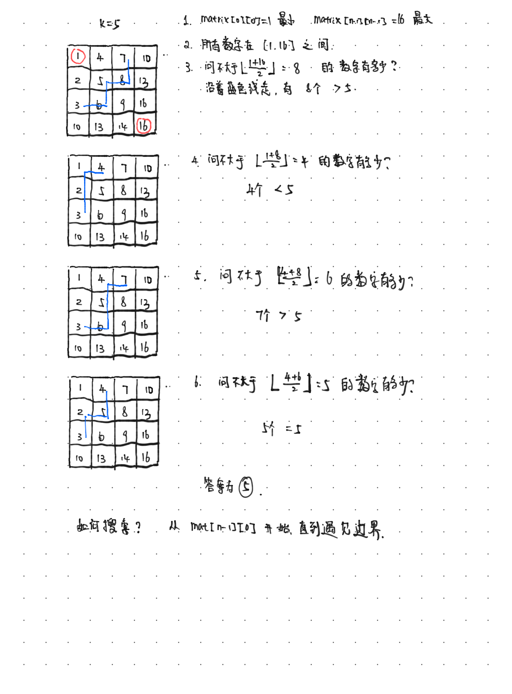

# Heap Basics

We consider the `minHeap` with `n` elements being stored. 

`minHeap`, is a complete binary tree, which can be stored in an array `A`. 

**Properties:**

1. Given the index of the element in the array `A`, the left child and right children of `A[i]` are `A[2i+1]` and `A[2i+2]` respectively. The parent of `A[i]` is `A[floor(i-1)/2]`.
2. (**Heap Property**)Excluding the root `A[0]`, `A[parent[i]] <= A[i]` for all $i>0$.

**Basic operations**

* `parent(i)`: return the parent of the node $i$.
* `left(i)`: return the left children of the node $i$.
* `right(i)`: return the right children of the node $i$.

* `insert(element)`: $O(\log(n))$. Put the inserted element at the end of the array. If it's larger than its parent, then there is nothing left to do. Otherwise, swap it with its parent. Repeat this process until either the inserted element becomes the first element of the array or find a parent which is smaller than the inserted element.

* `delete()`: $O(\log(n))$.  Place the root element in a variable to return later. Remove the last element in the deepest level and move it to the root. While the moved element has a value greater than at least one of its children, swap this value with the smaller-valued child.  Return the original root that was saved.


**heapify and build-heap**

* `heapify(A,i)`: Matain the **Heap Property** of a subtree rooted at `i`. Its inputs are an array `A` and an index `i` into the array. When `heapify(A,i)` is called, it is assumed that the binary trees rooted at `left(i)` and `right(i)` are `minHeaps`, but that `A[i]` may be larger than its children, thus violating the**Heap Property**. The function of `heapify(A,i)` is to let the value at `A[i]` "float down" in the heap so that the subtree rooted at index `i` becomes a heap. To achieve this, you just need to compare `A[i]` with `A[left(i)]` and `A[right(i)]` and swap when necessary. (Similart to `delete()` but nothing is deleted.) The complexity is $O(\texttt{height}(i))$, where $\texttt{height}(i)$ is the height of node `i` in the tree.

* `build-heap(L)`: Its input is an unsorted array `L` with size `n`. Then do the following.

  ```
    for i := floor(n/2) downto 1 
            do HEAPIFY(L, i); 
    end for 
  ```
  
  The last `floor(n/2)` elements of height 0, hence already are `minHeap` themselves. The total time comlexity is
  $$
    \sum_{h=1}^{\log_2(n)} \lceil \frac{n}{2^{h+1}}\rceil * O(\log_2(h)) = O(n).
  $$


# 215 数组中第k个最大元素

```
在未排序的数组中找到第 k 个最大的元素。请注意，你需要找的是数组排序后的第 k 个最大的元素，而不是第 k 个不同的元素。

示例 1:

输入: [3,2,1,5,6,4] 和 k = 2
输出: 5
示例 2:

输入: [3,2,3,1,2,4,5,5,6] 和 k = 4
输出: 4
说明:

你可以假设 k 总是有效的，且 1 ≤ k ≤ 数组的长度。

来源：力扣（LeetCode）
链接：https://leetcode-cn.com/problems/kth-largest-element-in-an-array
著作权归领扣网络所有。商业转载请联系官方授权，非商业转载请注明出处。
```

## 思路

1. 利用前k个数构造一个大小为k的minHeap
2. 从第k+1个数开始将其与minHeap中的root相比较，如果比root大则移除root并插入该元素 （同时维持minHeap的性质）
遍历完成后，minHeap中为最大的k个数，且第k大的数在root

## 代码

```python
import heapq
class Solution:
    def findKthLargest(self, nums: List[int], k: int) -> int:
        minHeap = nums[:k]
        heapq.heapify(minHeap)
        for i in nums[k:]:
            if i > minHeap[0]:
                heapq.heappushpop(minHeap, i)
        return minHeap[0]
```

## 复杂度

1. 时间$O(k + (n-k)logk)$: 
    * 建大小为k的minHeap:  $O(k)$
    * 比较并(可能插入)n-k个元素: $O((n-k)log(k))$ 
2. 空间复杂度 $O(k)$

# 1046. 最后一块石头的重量

```
有一堆石头，每块石头的重量都是正整数。

每一回合，从中选出两块 最重的 石头，然后将它们一起粉碎。假设石头的重量分别为 x 和 y，且 x <= y。那么粉碎的可能结果如下：

如果 x == y，那么两块石头都会被完全粉碎；
如果 x != y，那么重量为 x 的石头将会完全粉碎，而重量为 y 的石头新重量为 y-x。
最后，最多只会剩下一块石头。返回此石头的重量。如果没有石头剩下，就返回 0。

 

示例：

输入：[2,7,4,1,8,1]
输出：1
解释：
先选出 7 和 8，得到 1，所以数组转换为 [2,4,1,1,1]，
再选出 2 和 4，得到 2，所以数组转换为 [2,1,1,1]，
接着是 2 和 1，得到 1，所以数组转换为 [1,1,1]，
最后选出 1 和 1，得到 0，最终数组转换为 [1]，这就是最后剩下那块石头的重量。
 

提示：

1 <= stones.length <= 30
1 <= stones[i] <= 1000

来源：力扣（LeetCode）
链接：https://leetcode-cn.com/problems/last-stone-weight
著作权归领扣网络所有。商业转载请联系官方授权，非商业转载请注明出处。
```

## 思路

1.构建一个`maxHeap`
2.每次从`maxHeap`中`pop`两个出来(如果有元素的话)
3.如果`y-x>0` 则`push`进`maxHeap`直到`maxHeap`为空

## 代码

```python
import heapq
class Solution:
    def lastStoneWeight(self, stones: List[int]) -> int:
        if not stones:
            return 0
        maxHeap = [-i for i in stones]
        heapq.heapify(maxHeap)
        while len(maxHeap) > 1:
            y = -heapq.heappop(maxHeap)
            x = -heapq.heappop(maxHeap)
            if x != y:
                heapq.heappush(maxHeap, x-y)
        if not maxHeap:
            return 0
        else:
            return -maxHeap[0]
```

## 复杂度

* 时间复杂度：$O(nlog_2n)$
* 空间复杂度：$O(n)$

# 23. 合并k个升序链表

```
给你一个链表数组，每个链表都已经按升序排列。

请你将所有链表合并到一个升序链表中，返回合并后的链表。

 

示例 1：

输入：lists = [[1,4,5],[1,3,4],[2,6]]
输出：[1,1,2,3,4,4,5,6]
解释：链表数组如下：
[
  1->4->5,
  1->3->4,
  2->6
]
将它们合并到一个有序链表中得到。
1->1->2->3->4->4->5->6
示例 2：

输入：lists = []
输出：[]
示例 3：

输入：lists = [[]]
输出：[]
 

提示：

k == lists.length
0 <= k <= 10^4
0 <= lists[i].length <= 500
-10^4 <= lists[i][j] <= 10^4
lists[i] 按 升序 排列
lists[i].length 的总和不超过 10^4

来源：力扣（LeetCode）
链接：https://leetcode-cn.com/problems/merge-k-sorted-lists
著作权归领扣网络所有。商业转载请联系官方授权，非商业转载请注明出处。
```

## 思路一： 暴力合并k个链表

遍历`lists`里所有的链表，然后套用合并两个链表的模板。

### 代码

```python
# Definition for singly-linked list.
# class ListNode:
#     def __init__(self, val=0, next=None):
#         self.val = val
#         self.next = next
class Solution:
    def mergeKLists(self, lists: List[ListNode]) -> ListNode:
        if not lists:
            return None
        n = len(lists)
        merged = lists[0]
        for i in range(1, n):
            tobeMerge = lists[i]
            l1 = merged
            l2 = tobeMerge
            ans = ListNode()
            cur = ans
            while l1 and l2:
                if l1.val <= l2.val:
                    cur.next = l1
                    l1 = l1.next
                else:
                    cur.next = l2
                    l2 = l2.next 
                cur = cur.next
            if l1 is None:
                cur.next = l2
            else:
                cur.next = l1
            merged = ans.next
        return merged
```
### 复杂度

* 时间复杂度: 假设`lists`里有`k`个链表，`n`为`k`个链表的最大长度。则时间复杂度为$O(k^2n)$
* 空间复杂度: $O(1)$

## 最小堆

### 思路


### 代码

```python
import heapq
# override default method for LitsNode class.
def __lt__(self, other):
    return  self.val < other.val
def __le__(self, other):
    return  self.val < other.val
ListNode.__lt__ = __lt__
ListNode.__le__ = __le__

class Solution:
    def mergeKLists(self, lists: List[ListNode]) -> ListNode:
        minHeap = []
        # 本来想用heapify但是存在[[],[]]输入。。。
        for node in lists:
            if node:
                heapq.heappush(minHeap, node)
        ans = ListNode()
        cur = ans
        while minHeap:
            curMin = heapq.heappop(minHeap)
            cur.next = curMin
            cur = cur.next
            if curMin.next:
                heapq.heappush(minHeap, curMin.next)
        return ans.next
```

### 复杂度

* 时间复杂度: 假设`lists`里有`k`个链表，`n`为`k`个链表的最大长度。则时间复杂度为$O(nk\log_2k)$
* 空间复杂度: $O(k)$ --- `minHeap`的大小


# 378. 有序矩阵中第k小的元素

```
给定一个 n x n 矩阵，其中每行和每列元素均按升序排序，找到矩阵中第 k 小的元素。
请注意，它是排序后的第 k 小元素，而不是第 k 个不同的元素。

 

示例：

matrix = [
   [ 1,  5,  9],
   [10, 11, 13],
   [12, 13, 15]
],
k = 8,

返回 13。
 

提示：
你可以假设 k 的值永远是有效的，1 ≤ k ≤ n2 。


来源：力扣（LeetCode）
链接：https://leetcode-cn.com/problems/kth-smallest-element-in-a-sorted-matrix
著作权归领扣网络所有。商业转载请联系官方授权，非商业转载请注明出处。
```

## 思路1: 遍历 + maxHeap

遍历整个矩阵，构建并维护一个大小为`k`的`maxHeap`。只有当新元素比堆顶的元素（堆中最大的元素）小的时候才将堆顶元素弹出，新元素压入。这样可以保证遍历完矩阵后，堆顶的元素为第`k`小的元素。

### 代码

```python
import heapq
class Solution:
    def kthSmallest(self, matrix: List[List[int]], k: int) -> int:
        if not matrix or not matrix[0]:
            return 0
        self.maxHeap = []
        n = len(matrix)
        for i in range(n):
            for j in range(n):
                self.addElement(matrix[i][j], k)
        return -self.maxHeap[0]
    def addElement(self, e, k):
        if len(self.maxHeap) < k:
            heapq.heappush(self.maxHeap, -e)
        else:
            if e < -self.maxHeap[0]:
                out = heapq.heappushpop(self.maxHeap, -e)
```

### 复杂度

* 时间: $O(n^2log_2k)$ --- 每个元素都被压入(弹出)`maxHeap`中。
* 空间: $O(k)$  --- 维护一个大小为`k`的`maxHeap`.

时间和空间复杂度会比将整个二维矩阵变为一维数列再排序要好。

## 模仿合并k个升序链表（23）


### 代码

```python
import heapq
class Solution:
    def kthSmallest(self, matrix: List[List[int]], k: int) -> int:
        if not matrix or not matrix[0]:
            return 0
        j = 0
        n = len(matrix)
        minHeap = [(matrix[i][j], i, j) for i in range(n)]
        heapq.heapify(minHeap)
        print(minHeap)
        while k > 0:
            head = heapq.heappop(minHeap)
            i,j = head[1], head[2]
            if j <= n-2:
                heapq.heappush(minHeap, (matrix[i][j+1], i, j+1))
            k -= 1
        return head[0]
```

### 复杂度

* 时间: $O(n+k\log_2n)$ --- $O(n)$建`minHeap`; $O(k\log_2n)$ 压入弹出`k`个元素。最坏的情况下$k=n^2$.
* 空间: $O(n)$  --- 维护一个大小为`n`的`minHeap`.


## 思路三： 二分法（官方题解）



```python
class Solution:
    def kthSmallest(self, matrix: List[List[int]], k: int) -> int:
        def search(target, n):
            ans = 0
            i = n - 1
            j = 0
            while i >= 0 and j < n:
                if matrix[i][j] <= target:
                    # elements from matrix[0][j] to matrix[i][j]
                    # are smaller than the target
                    ans += (i + 1) # there are i+1 elements in selected column qualified
                    # check the next column
                    j += 1
                else:
                    i -= 1
            return ans
        if not matrix or not matrix[0]:
            return 0
        n = len(matrix)
        left, right = matrix[0][0], matrix[n-1][n-1]
        count = n * n + 1
        while left<right:
            mid = (left + right) // 2
            count = search(mid, n)
            if count < k:
                left = mid + 1
            else:
                right = mid
        return left
```

### 复杂度

* 时间: $O(nlog_2(r-l))$ --- `l`, `r`分别为矩阵中最大最小元素
* 空间: $O(1)$ 

# 1054 条形码

```
在一个仓库里，有一排条形码，其中第 i 个条形码为 barcodes[i]。

请你重新排列这些条形码，使其中两个相邻的条形码 不能 相等。 你可以返回任何满足该要求的答案，此题保证存在答案。

 

示例 1：

输入：[1,1,1,2,2,2]
输出：[2,1,2,1,2,1]
示例 2：

输入：[1,1,1,1,2,2,3,3]
输出：[1,3,1,3,2,1,2,1]
 

提示：

1 <= barcodes.length <= 10000
1 <= barcodes[i] <= 10000
 

来源：力扣（LeetCode）
链接：https://leetcode-cn.com/problems/distant-barcodes
著作权归领扣网络所有。商业转载请联系官方授权，非商业转载请注明出处。
```
## 思路

第一反应，见缝插针。举个例子
 
```
barcodes: [1,1,1,1,2,2,2,3,3]

1 出现的频次最多, 所以我们希望用2，3来将其分割开。那些位置可以插入呢? 下图横线中位置都可放入

_ 1 _ 1 _ 1 _ 1 _

考虑一种插入
_ 1 _  2 _ 1 _ 2 _ 1 _ 2 _
```

但是每次去记录可以插入的位置以及可以插入的数字是很头痛的事情。其实上述思路有可以稍微修改一下，优先使用`barcodes`出现频次最高的，后面接上一个出现频次第二高的。 用画图的方式来阐述这个点。


## 代码

```python
import heapq
from collections import Counter
class Solution:
    def rearrangeBarcodes(self, barcodes: List[int]) -> List[int]:
        # edge case
        if len(barcodes) == 1:
            return barcodes
        c = Counter(barcodes)
        # create (freq, label) pairs
        maxHeap = [(-i[1], i[0]) for i in c.items()]
        heapq.heapify(maxHeap)
        ans = []
        while len(maxHeap) >= 2:
            pair1 = heapq.heappop(maxHeap)
            pair2 = heapq.heappop(maxHeap)
            ans.append(pair1[1])
            ans.append(pair2[1])
            if -pair1[0] - 1 > 0:
                heapq.heappush(maxHeap, (pair1[0]+1, pair1[1]))
            if -pair2[0] - 1 > 0:
                heapq.heappush(maxHeap, (pair2[0]+1, pair2[1]))
        if len(maxHeap) == 1:
            # only one pair left in the maxHeap and the freq is
            # guaranteed to be 1
            ans.append(maxHeap[0][1])
        return ans
```


## 复杂度

* 时间复杂度：$O(n\log_2n)$
    * 统计频次 $O(n)$
    * 建堆 $O(n)$
    * 每个元素出堆 $O(n\log_2n)$
* 空间复杂度: $O(n)$ 
