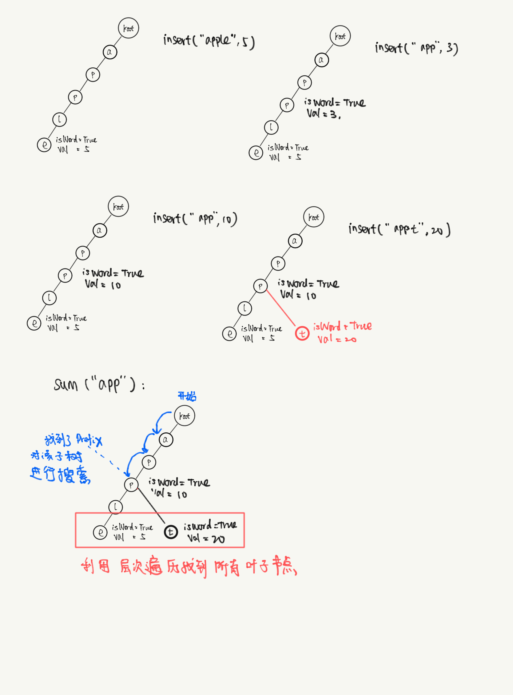

# 前缀树的数据结构

[参考](https://github.com/leetcode-pp/91alg-2/blob/master/lecture/advanced-trie.md).

```python
class Node:
    def __init__(self, val: str, isWord=False) -> None:
        self.val = val
        self.children = {}
        self.isWord = isWord
class Trie:

    def __init__(self):
        """
        Initialize your data structure here.
        """
        self.root = Node(val=None)


    def insert(self, word: str) -> None:
        """
        Inserts a word into the trie.
        """
        node = self.root
        for char in word:
            if char not in node.children:
                node.children[char] = Node(val=char)
            node = node.children[char]
        node.isWord = True

    def search(self, word: str) -> bool:
        """
        Returns if the word is in the trie.
        """
        node = self.root
        for char in word:
            if char not in node.children:
                return False
            node = node.children[char]
        if node.isWord: return True
        return False

    def startsWith(self, prefix: str) -> bool:
        """
        Returns if there is any word in the trie that starts with the given prefix.
        """
        node = self.root
        for char in prefix:
            if char not in node.children:
                return False
            node = node.children[char]
        return True
```

* 时间复杂度：$O(n)$，n 是字符串长度， `insert` `search` `startsWith` 操作都是。
* 空间复杂度：$O(26^{h})$，h 是插入所有字符串最长的长度。

# 677. 键值映射

## 题目描述
```
实现一个 MapSum 类，支持两个方法，insert 和 sum：

MapSum()  初始化 MapSum 对象
void insert(String key, int val) 插入 key-val 键值对，字符串表示键 key ，整数表示值 val 。如果键 key 已经存在，那么原来的键值对将被替代成新的键值对。
int sum(string prefix) 返回所有以该前缀 prefix 开头的键 key 的值的总和。


示例：

输入：
["MapSum", "insert", "sum", "insert", "sum"]
[[], ["apple", 3], ["ap"], ["app", 2], ["ap"]]
输出：
[null, null, 3, null, 5]

解释：
MapSum mapSum = new MapSum();
mapSum.insert("apple", 3);  
mapSum.sum("ap");           // return 3 (apple = 3)
mapSum.insert("app", 2);    
mapSum.sum("ap");           // return 5 (apple + app = 3 + 2 = 5)


提示：

1 <= key.length, prefix.length <= 50
key 和 prefix 仅由小写英文字母组成
1 <= val <= 1000
最多调用 50 次 insert 和 sum

来源：力扣（LeetCode）
链接：https://leetcode-cn.com/problems/map-sum-pairs
著作权归领扣网络所有。商业转载请联系官方授权，非商业转载请注明出处。
```

## 思路

1. 题干中要求`返回以该前缀 prefix 开头的键 key 的值的总和` --- 前缀树，空间换时间。使用前缀树模版。

2. `insert(key, val)`: 将key中的每一个字符作为一个多叉树的node, 依次将node放入树中。最后需要在leaf node上记录 val， 并将其标记为一个单词的结尾。如果插入的重复的key, 只需跟新leaf node的值就好。

3. `sum(prefix)`:  沿着多叉树找到以`prefix`最后一个字符结尾的node(如果存在)。利用层次遍历其所有的leaf node，然后将上面的数字求和便可得到答案。


  
  
## 代码
  
```python
class Node:
  def __init__(self, key=None, isWord=False, val=None):
  self.key = key
  self.children = {}
  self.isWord = isWord
  self.val = None

class MapSum:
  def __init__(self):
  """
  Initialize your data structure here.
  """
  self.root = Node()
  def insert(self, key: str, val: int) -> None:
    node = self.root
  for char in key:
    if char not in node.children:
    node.children[char] = Node(key=char)
  node = node.children[char]
  # the last node stores the last char in key, hence is a word
  node.isWord = True
  node.val = val
  
  def sum(self, prefix: str) -> int:
    node = self.root
  ans = 0
  for char in prefix:
    if char not in node.children:
    return ans
  node = node.children[char]
  # the node stores the ending char in the prefix
  queue = [node]
  while queue:
    node = queue.pop(0)
  if node.isWord: ans += node.val
  for child in node.children:
    queue.append(node.children[child])
  return ans
```

## 复杂度

* 时间
* insert: $O(n)$, n ---> key这个字符串的长度
* sum: $O(26^h)$, h---> h为多叉树的高度。最差的情况prefix在root，树是一个满多叉树。
* 空间： $O(26^h)$


# 题目: 面试题 17.17. 多次搜索

```
给定一个较长字符串big和一个包含较短字符串的数组smalls，设计一个方法，根据smalls中的每一个较短字符串，对big进行搜索。输出smalls中的字符串在big里出现的所有位置positions，其中positions[i]为smalls[i]出现的所有位置。

示例：

输入：
big = "mississippi"
smalls = ["is","ppi","hi","sis","i","ssippi"]
输出： [[1,4],[8],[],[3],[1,4,7,10],[5]]
提示：

0 <= len(big) <= 1000
0 <= len(smalls[i]) <= 1000
smalls的总字符数不会超过 100000。
你可以认为smalls中没有重复字符串。
所有出现的字符均为英文小写字母。

来源：力扣（LeetCode）
链接：https://leetcode-cn.com/problems/multi-search-lcci
著作权归领扣网络所有。商业转载请联系官方授权，非商业转载请注明出处。
```

## 思路 1： 暴力搜索（超时）

对每个来自`smalls`中的word`small` 遍历一次`big`去匹配。

```python
class Solution:
    def multiSearch(self, big: str, smalls: List[str]) -> List[List[int]]:
        nBig = len(big)
        ans = []
        for idx, small in enumerate(smalls):
            ans.append([])
            if small == "":
                continue
            nSmall = len(small)
            idx_small = 0
            prefix = small[idx_small]
            # find the occurence of the prefix of the small in big
            # print("search for:'{}' | prefix:{}".format(small, prefix))
            for i in range(nBig):
                # print("Seach the {}-th char in big to match prefix.".format(i))
                if big[i] == prefix:
                    # print("   prefix matched!")
                    for j in range(i, i+nSmall):
                        if j < nBig:
                            if small[idx_small] == big[j]:
                                idx_small += 1
                            else:
                                break
                    # match
                    if idx_small == nSmall:
                        # print("   matched")
                        ans[-1].append(i)
                    # reset index to loop over small
                    idx_small = 0
        return ans
```

* 时间复杂度: $O(n_{big} * n_{smalls} * s_{max})$: 其中 $n_{big}$, $n_{smalls}$, $s_{max}$分别是 字符串`big`的长度，`smalls` 单词的个数，以及`smalls`中单词最大的长度。

* 空间复杂度：$O(1)$ (不算返回的数组)


## 思路 2：前缀树

* 用什么建树：第一反应是用 `big`的所有子字符串去建树，有如下问题
    * 空间复杂度和最大长度有关，如果`big`很长，就很糟糕。
    * 找所有子列是$O(2^{n_{big}})$的复杂度
所以用`smalls`中的字符串去建树。

* 怎么设计前缀树
    * 除了套用模板记录 `isWord` 之外，我们需要用一个 属性`idx` 来表明当前这个字符(如果代表一个word)在smalls中的位置。
   


```python
class Node:
    def __init__(self, idx=None):
        self.children = {}
        self.isWord = False
        self.idx = idx
class Solution:
    def insert(self, word, idx):
        node = self.root
        for char in word:
            if char not in node.children:
                node.children[char] = Node()
            node = node.children[char]
        # reach the end of the word
        node.idx = idx
        node.isWord = True

    def multiSearch(self, big: str, smalls: List[str]) -> List[List[int]]:
        n = len(smalls)
        self.root =  Node()
        ans = []
        # build the trie
        for i in range(n):
            self.insert(smalls[i], i)
            ans.append([])
        # begin search
        nBig = len(big)
        for i in range(nBig):
            node = self.root
            for j in range(i, nBig):
                current_char = big[j]
                # no match
                if current_char not in node.children:
                    break
                if node.children[current_char].isWord:
                    ans[node.children[current_char].idx].append(i)
                node = node.children[current_char]
        return ans
```

* 时间复杂度: 
    * 建树: $O(n_{small} * s_{max})$
    * 搜索: $O(s_{max} * n_{big})$
    * 显著的比暴力的 $O(n_{big} * n_{smalls} * s_{max})$ 节约时间
* 空间复杂度：
    * 建树：$O(n_{small} * s_{max})$
